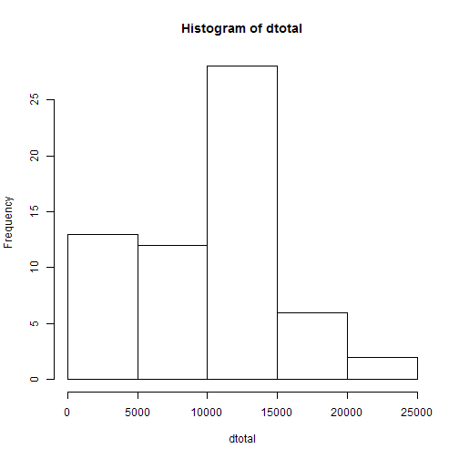
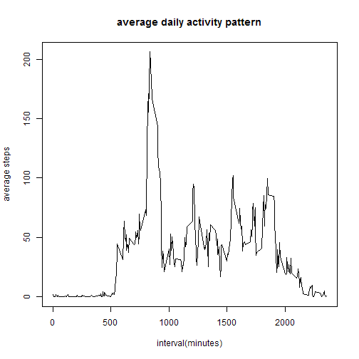
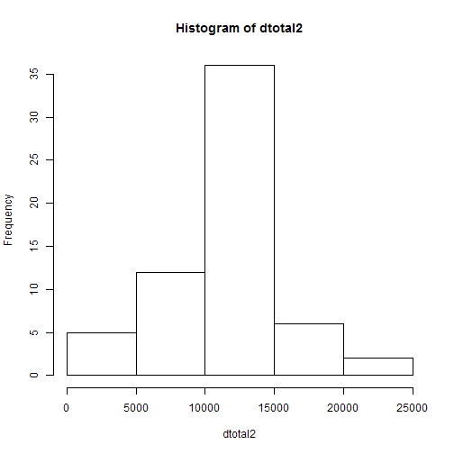
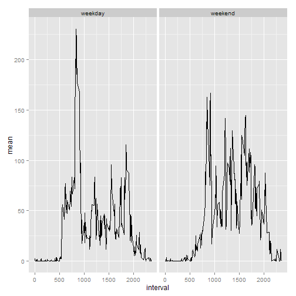

#No.1 peer assignment for Reproducible Research

- Loading and preprocessing the data
suppose we've set the wd where we can find activity.csv

```r
setwd('d:/git/coursera/reproducible_research/RepData_PeerAssessment1')
data <- read.csv('activity.csv')
data$date <- as.Date(data$date)
```

- What is mean total number of steps taken per day?

```r
dtotal <- tapply(data$steps,data$date,sum,na.rm = TRUE)
hist(dtotal)
```

 

```r
mean <- mean(dtotal)
med <- median(dtotal)
```
The mean of total steps taken per day is 9354.2295082, median is 10395

- What is the average daily activity pattern?

```r
mean_interval <- tapply(data$steps,data$interval,mean,na.rm = TRUE)
plot(unique(data$interval),mean_interval,type = 'l',main = 'average daily activity pattern',xlab = 'interval(minutes)',ylab = 'average steps')
```

 

```r
max_interval <- names(mean_interval[mean_interval == max(mean_interval)])
```
Among the 5-minute intervals, the 835 interval contains the maximum number of steps

- Imputing missing values

```r
missing <- sum(is.na(data$steps))
```
The total number of missing values in the dataset is 2304.

The strategy I use here is to fill in missing values with the mean for that interval.

```r
data2 <- data
mean_interval2 <- tapply(data$steps,data$interval,mean,na.rm = TRUE)
rows <- row(data2)[,1]
for (i in rows){
  if (is.na(data2[i,1])==TRUE){
    data2[i,1] = mean_interval2[rownames(mean_interval2) == data[i,3]]
  }
}
dtotal2 <- tapply(data2$steps,data2$date,sum,na.rm = TRUE)
hist(dtotal2)
```

 

```r
mean2 <- mean(dtotal2)
med2 <- median(dtotal2)
med2 <- round(med2,0)
mean2 <- round(mean2,0)
```
The mean of total steps taken per day is 1.0766 &times; 10<sup>4</sup>, median is 1.0766 &times; 10<sup>4</sup>.They are NOT the same with results in the first part.

- Are there differences in activity patterns between weekdays and weekends?

```r
Sys.setlocale('LC_TIME','English')
```

```
## [1] "English_United States.1252"
```

```r
is_wkend <- weekdays(data2[,2])=='Saturday' | weekdays(data2[,2])=='Sunday'
is_wkend <- factor(is_wkend,labels = c('weekday','weekend'))
data2$weekday <- is_wkend
library(plyr)
d <- ddply(data2,.(interval,weekday),summarize,mean = round(mean(steps),2))
library(ggplot2)
qplot(interval,mean,data = d,facets = .~weekday,geom = 'line')
```

 
